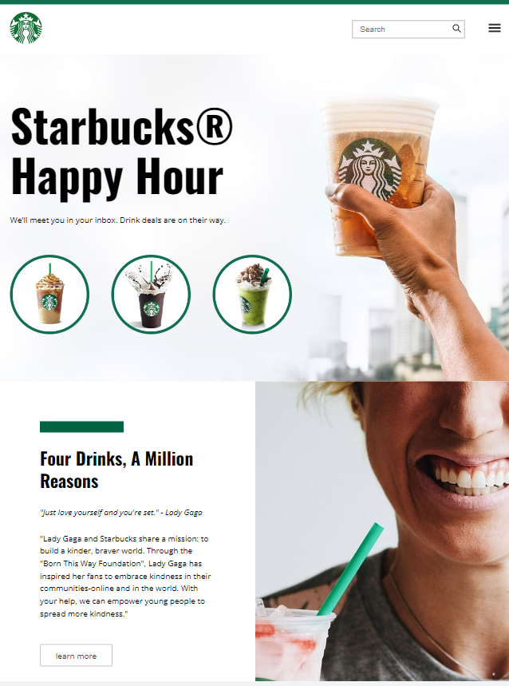
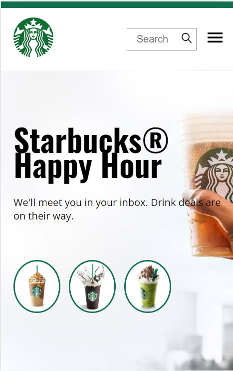

# Starbucks-HTML-CSS-Clone
"Clone Estático do Layout Starbucks - HTML &amp; CSS Repositório contendo uma réplica do layout do site Starbucks, criada com HTML e CSS. Desenvolvido para praticar as técnicas de Flexbox e Grid no CSS, com foco em layouts responsivos. Objetivo puramente educacional, excluindo a funcionalidade JavaScript do site original."

## Demostração em Desktop

## Demostração Mobile

## Créditos
Desenvolvido por Jeanderson Santos Durante aula do curso B7Web